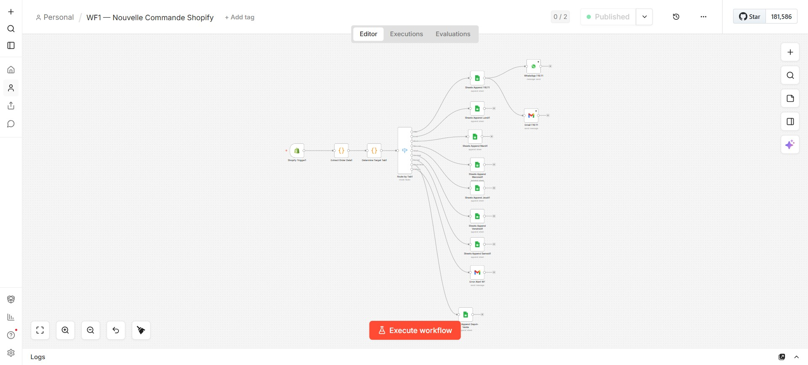
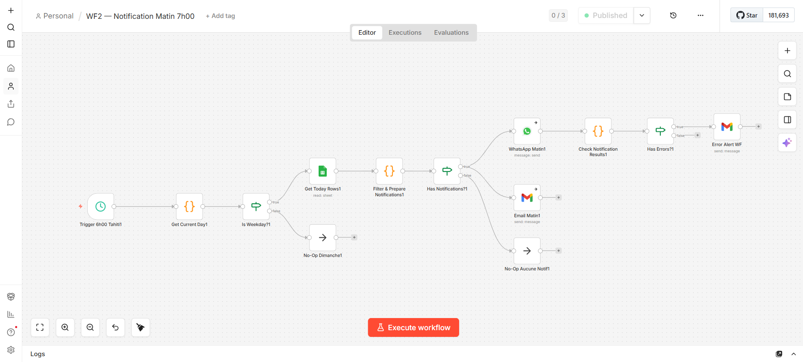
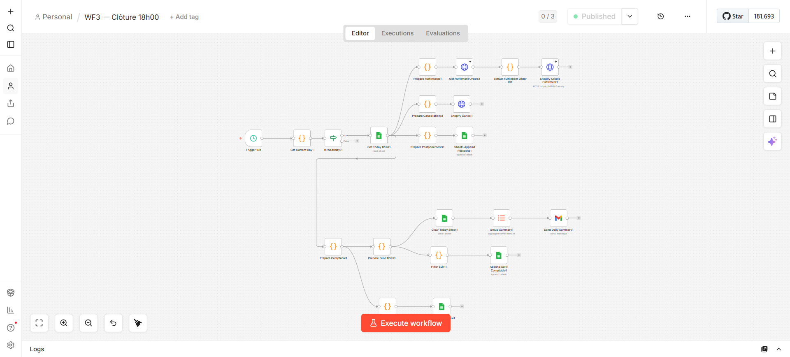
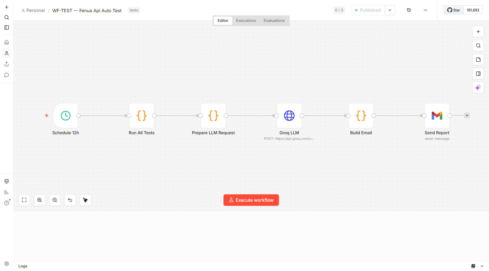

# Fenua Api — Automatisation des Livraisons

Système d'automatisation n8n pour la gestion des commandes et livraisons de [Fenua Api](https://fenuapi.pf) en Polynésie française.

**Stack :** n8n · Shopify · Google Sheets · Twilio (SMS) · WhatsApp Business API

---

## Aperçu des workflows

### WF1 — Nouvelle Commande Shopify


### WF2 — Notification Matin 7h00


### WF3 — Clôture 18h00


### WF-TEST — Runner automatique (toutes les 12h)


---

## Architecture

```
Shopify (nouvelle commande)
        │
        ▼
┌─────────────────────────────────────────────────────┐
│  WF1 — Nouvelle Commande                            │
│                                                     │
│  Extraction → Routing → Google Sheets + WhatsApp   │
│                                                     │
│  Feuilles cibles :                                  │
│  Lundi / Mardi / Mercredi / Jeudi / Vendredi       │
│  Samedi (zones éloignées) / FRET / Depot vente     │
└─────────────────────────────────────────────────────┘
        │
        ▼
┌─────────────────────────────────────────────────────┐
│  WF2 — Notification Matin 7h00                      │
│                                                     │
│  Résumé SMS des livraisons du jour → Livreurs       │
└─────────────────────────────────────────────────────┘
        │
        ▼
┌─────────────────────────────────────────────────────┐
│  WF3 — Clôture Journalière 18h00                    │
│                                                     │
│  Lecture planning → Comptabilité → Historique       │
│  → Suivi par livreur×paiement → SMS récapitulatif  │
└─────────────────────────────────────────────────────┘
```

---

## Workflows

### WF1 — Nouvelle Commande Shopify

Déclenché à chaque nouvelle commande Shopify. Détermine la feuille de planning cible selon une logique de priorité :

| Priorité | Condition | Destination |
|----------|-----------|-------------|
| 1 | `shipping_lines[0].title === "Fret pour les îles"` | Feuille **FRET** |
| 2 | Titre contient `recup` ou `depot` (insensible aux accents) | Feuille **Depot vente** |
| 3 | Ville dans zones éloignées (Taravao, Papara, Mahina…) | Feuille **Samedi** |
| 4 | Commande vendredi/samedi/dimanche | Feuille **Lundi** |
| 5 | Sinon | Feuille du **lendemain** |

Notifications envoyées via **WhatsApp Business API** pour les commandes FRET.

### WF2 — Notification Matin 7h00

Déclenché chaque matin à 7h00 (heure Tahiti, UTC-10). Agrège les livraisons du jour depuis Google Sheets et envoie un SMS récapitulatif à chaque livreur via **Twilio**.

### WF3 — Clôture Journalière 18h00

Déclenché chaque soir à 18h00. Lit la feuille du jour, calcule les totaux par livreur et moyen de paiement, met à jour :

- **Historique** — archive toutes les lignes livrées
- **Suivi Comptable** — 1 ligne par livreur × moyen de paiement

La chaîne s'exécute toujours jusqu'au bout, même si 0 livraisons (pattern `_summaryOnly`).

---

## Structure du projet

```
fenua-api-automation/
├── WF1 — Nouvelle Commande Shopify.json   # Workflow n8n — import direct
├── WF2 — Notification Matin 7h00.json    # Workflow n8n — import direct
├── WF3 — Clôture 18h00.json              # Workflow n8n — import direct
├── FenuaApi_Planning_Modele.xlsx          # Template Google Sheets (structure des feuilles)
├── cahier-des-charges-FINAL.md            # Spécifications complètes
├── package.json
├── tests/
│   ├── program.md        # Critères d'acceptance et métriques
│   ├── generators.js     # Générateurs de données de test
│   ├── simulators.js     # Simulation JS exacte des workflows
│   └── runner.js         # Runner autonome (autoresearch loop)
└── results/              # Rapports de test générés (gitignored)
```

---

## Importer dans n8n

1. Ouvrir n8n → **Workflows** → `+ New`
2. Menu `⋯` → **Import from file**
3. Sélectionner le fichier JSON du workflow
4. Lier les credentials (Google Sheets, Twilio, WhatsApp, Shopify)
5. **Save** → **Activate**

> Répéter pour les 3 workflows dans l'ordre : WF1, WF2, WF3.

### Credentials nécessaires

| Service | Type n8n | Usage |
|---------|----------|-------|
| Google Sheets | OAuth2 | Lecture/écriture planning |
| Shopify | API Key | Trigger + fulfillments |
| Twilio | Account SID / Auth Token | SMS livreurs |
| WhatsApp Business | WhatsApp Account (token permanent) | Notifications FRET |
| Gmail / SMTP | OAuth2 | Rapport journalier WF3 |

### Variables d'environnement à configurer dans n8n

```
GOOGLE_SHEET_ID         — ID du Google Sheet de planning
TWILIO_FROM_NUMBER      — Numéro Twilio source (format +689XXXXXXXX)
WA_PHONE_NUMBER_ID      — Phone Number ID WhatsApp Business
RECIPIENT_EMAIL         — Email destinataire rapport WF3
```

---

## Tests automatisés

Le dossier `tests/` contient un framework autonome inspiré de [autoresearch](https://github.com/karpathy/autoresearch) : génération → simulation → évaluation → rapport, en boucle.

### Lancer les tests

```bash
# Rapide (1 cycle, 10 scénarios aléatoires par WF)
npm run test:quick

# Standard (3 cycles, arrêt dès 3 cycles consécutifs sans échec)
npm test

# Complet (5 cycles × 50 scénarios)
npm run test:full
```

### Ce qui est testé

**WF1 — 10 cas critiques fixes + N aléatoires**
- Routing FRET (titre exact `"Fret pour les îles"`)
- Routing Dépôt-Vente (insensible aux accents/casse : `DEPOT`, `dépôt`, `recup`, `Récupération`)
- Zones éloignées → Samedi
- Week-end → Lundi
- Commande sans adresse (`shipping_address: null`)
- Formatage téléphone → E.164 (`+689XXXXXXXX`)
- Prix → format `XXXX F`

**WF3 — 10 cas critiques fixes + N aléatoires**
- 0 livraisons → chaîne complète (pas de blocage)
- `"Non livrée"` n'est pas comptée comme livrée
- `"livree"` minuscules / `"LIVREE"` majuscules → comptée
- Livreur vide → `"Non assigné"`
- Prix malformé (`N/A`, `""`) → 0
- Même livreur, 2 paiements différents → 2 lignes Suivi
- `_summaryOnly` filtré avant écriture Sheets

### Résultat attendu

```
=== Fenua Api — Runner autonome ===
Cycles: 3  |  Scenarios/WF: 30  |  Streak cible: 3

Cycle 1  [OK]  80/80 passes
Cycle 2  [OK]  80/80 passes
Cycle 3  [OK]  80/80 passes

Arrêt : 3 cycles consécutifs sans échec.
FIN  3 cycles  |  240 passes / 0 échecs
Statut: TOUS LES TESTS PASSENT
```

---

## Corrections apportées (changelog)

| Date | Workflow | Fix |
|------|----------|-----|
| 2026-03 | WF1 | Schéma colonnes Google Sheets aligné sur l'ordre réel du fichier XLSX |
| 2026-03 | WF1 | Branche Dépôt-Vente ajoutée (routing + feuille `Depot vente`) |
| 2026-03 | WF3 | `"Non livrée"` était comptée comme livrée (`includes('livre')` sans exclusion) |
| 2026-03 | WF3 | Chaîne stoppée sur 0 livraisons → pattern `_summaryOnly` + `Filter` nodes |
| 2026-03 | WF3 | `Send Daily Summary` : `.item` → `.last()` (paired item error) |
| 2026-03 | WF3 | Suivi Comptable : 1 ligne par livreur × moyen de paiement (était JSON blob) |

---

## Fuseau horaire

Tout le système opère en **Pacific/Tahiti (UTC-10)**. Les dates sont calculées avec Luxon natif n8n (`DateTime.now().setZone('Pacific/Tahiti')`), jamais avec `new Date()`.

Weekdays Luxon : 1=Lun, 2=Mar, 3=Mer, 4=Jeu, 5=Ven, 6=Sam, 7=Dim.
